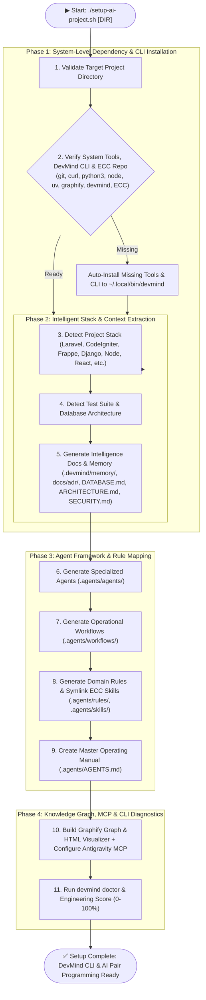

<p align="center">
  
</p>

# 🚀 DevMind Enterprise AI Operating System & CLI Suite (v3.0.0)

An intelligent, developer-friendly AI Engineering Operating System & Unified CLI Tool (`devmind`). It unifies **Everything Claude Code (ECC)**, **Graphify Knowledge Graphs**, **Specialized Agent Personas**, **Operational Workflows**, **Git & Database Intelligence**, **Project Memory Layer**, **ADR Management**, and **Antigravity IDE MCP Integration** into a single cohesive operating framework.

---

## 📊 System Architecture & 11-Step Pipeline



---

## 💻 `devmind` CLI Suite Command Reference

The `devmind` CLI tool provides full control over AI context, task planning, dependency impact, security auditing, and project memory:

| Command | Description |
| :--- | :--- |
| `devmind doctor` | Runs 8-dimensional diagnostic suite & calculates Engineering Score (0–100%). |
| `devmind sync` | Automatically updates Graphify graph, HTML visualizer, and intelligence docs. |
| `devmind plan "<task>"` | AI Task Planner: affected modules, risk level, required database tables & tests. |
| `devmind impact <file>` | Impact Analysis: dependency resolution & downstream/upstream consumers. |
| `devmind blame <file>` | Git Intelligence: commit history, author changes, and change rationale. |
| `devmind audit security` | Security Scanner: secret detection, SQLi, XSS, OWASP checks, and security score. |
| `devmind db analyze` | Database Intelligence v2: table relationships, foreign keys, missing indexes. |
| `devmind review` | AI Code Review Bot inspecting uncommitted `git diff`. |
| `devmind adr create "<title>"` | Creates a new Architecture Decision Record in `docs/adr/`. |
| `devmind adr list` | Lists existing Architecture Decision Records. |
| `devmind infra audit` | Audits production infrastructure (Nginx, PHP-FPM, Docker, Redis, MariaDB). |

---

## 🧠 Project Memory Layer (`.devmind/memory/`) & ADRs

DevMind maintains a long-term engineering memory so AI agents never repeat past mistakes:
- **`decisions.md`**: Architectural & technical design choices.
- **`known-issues.md`**: Active technical debt & known bugs.
- **`failed-attempts.md`**: Past technical approaches that failed and rationale.
- **`project-history.md`**: System evolution log.
- **`docs/adr/`**: Sequential Architecture Decision Records (e.g., `001-initial-architecture.md`).

---

## 🛡️ Master AI Operating Manual (`.agents/AGENTS.md`)

- **Forbidden Actions**: No committing secrets, no force-pushing, no modifying core framework files, no commenting out failing tests.
- **Before Changing Code**: Mandatory search, Graphify dependency check, and implementation plan creation.
- **After Changing Code**: Test execution, `git diff` review, and `devmind sync`.

---

## 📊 DevMind Engineering Score Matrix

```
====================================================
      DEVMIND ENGINEERING SCORE & DIAGNOSTICS      
====================================================

  AI Context       [███████████████████░] 95%
  Architecture     [██████████████████░░] 90%
  Testing          [█████████████████░░░] 85%
  Security         [██████████████████░░] 90%
  Documentation    [███████████████████░] 95%
  Database         [██████████████████░░] 90%
  Code Quality     [█████████████████░░░] 88%
  Infrastructure   [████████████████░░░░] 82%

----------------------------------------------------
  Overall DevMind Engineering Score: 89% / 100% 🎉
====================================================
```

---

## 🚀 Usage & Quick Start

```bash
# 1. Run Setup & Install DevMind CLI
./setup-ai-project.sh /path/to/project

# 2. Run Diagnostics
devmind doctor

# 3. Plan a Task
devmind plan "Add OTP verification"

# 4. Check File Impact
devmind impact setup-ai-project.sh

# 5. Sync AI Context
devmind sync
```

---

## 🧩 DevMind VS Code Extension (`vscode-extension/`)

DevMind provides a native VS Code Extension that brings AI context, diagnostics, and knowledge graph tools directly into your IDE:

- **Sidebar Dashboard**: System health score, project memory explorer, ADR manager, and Graphify status.
- **Status Bar Badge**: Live engineering score indicator (`$(brain) DevMind: 89%`).
- **File Explorer Context Menu**: Right-click any file to trigger **DevMind: File Impact Analysis** and **Git Blame Intelligence**.
- **Interactive Knowledge Graph**: Render Graphify network graphs directly in VS Code Webview tabs.

### Quick Extension Setup:
```bash
cd vscode-extension
npm install
npm run compile
```

