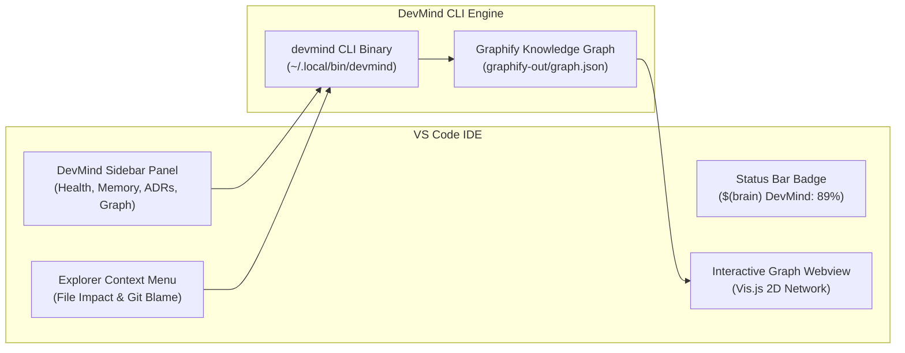

<p align="center">
  
</p>

# 🚀 DevMind VS Code Extension (`devmind-vscode`)

Official VS Code Extension for the **DevMind Enterprise AI Engineering Operating System & CLI Suite**.

---

## 🎨 Graphical Architecture & UI Layout



---

## ⚡ Features

### 1. 🩺 Live Engineering Score & Diagnostics
- Status bar item showing real-time Engineering Score badge (`DevMind: 89%`).
- Run `devmind doctor` diagnostics directly from VS Code to inspect the 8-dimensional health matrix.

### 2. 🧠 Project Memory & ADR Explorer
- Interactive Sidebar view browsing `.devmind/memory/` files (`decisions.md`, `known-issues.md`, `failed-attempts.md`, `project-history.md`).
- Manage and create Architecture Decision Records (`docs/adr/`) with auto-incremented sequence templates.

### 3. 📊 Knowledge Graph & File Impact Analysis
- Open embedded interactive HTML Knowledge Graph visualizers in VS Code Webview tabs.
- Right-click any file in the Explorer for instant **File Impact Analysis** (`devmind impact <file>`).
- Auto-focuses network nodes and filters dependencies in 2D space.

### 4. 🤖 AI Task Planning & Code Review
- Execute `DevMind: Plan AI Task` with interactive prompt boxes.
- Run security audits (`devmind.auditSecurity`), database schema checks (`devmind.dbAnalyze`), and AI code reviews (`devmind.review`) on uncommitted `git diff`.

---

## 🖼️ UI Sidebar Layout & Visual Reference

```text
+---------------------------------------------+
| DEVMIND OS DASHBOARD                        |
+---------------------------------------------+
| 🩺 System Health & Score                    |
|    ├── Engineering Score: 89%               |
|    ├── Run Doctor Diagnostics               |
|    └── Sync AI Context                      |
|                                             |
| 🧠 Project Memory                           |
|    ├── decisions.md                         |
|    ├── known-issues.md                      |
|    ├── failed-attempts.md                   |
|    └── project-history.md                   |
|                                             |
| 📜 Architecture Decisions (ADRs)            |
|    ├── + Create New ADR                     |
|    └── 001-initial-architecture.md          |
|                                             |
| 📊 Knowledge Graph & Impact                  |
|    ├── Graphify Index: Active               |
|    ├── Open Interactive Knowledge Graph     |
|    └── Analyze File Impact...               |
+---------------------------------------------+
```

---

## 💻 Available Commands & Shortcuts

| Command Title | Command ID | Description |
| :--- | :--- | :--- |
| `DevMind: Run Doctor Diagnostics` | `devmind.doctor` | Runs 8-dimensional Doctor diagnostics & refreshes score badge. |
| `DevMind: Sync AI Context` | `devmind.sync` | Rebuilds Graphify graph, HTML visualizer, and intelligence docs. |
| `DevMind: Plan AI Task` | `devmind.plan` | Interactive prompt to generate AI Task Plan & risk assessment. |
| `DevMind: File Impact Analysis` | `devmind.impact` | Performs file impact analysis & opens focused HTML graph view. |
| `DevMind: Git Blame Intelligence` | `devmind.blame` | Displays recent git commit history & change rationale for active file. |
| `DevMind: Audit Security` | `devmind.auditSecurity` | Runs security scan for hardcoded secrets, SQLi, and OWASP risks. |
| `DevMind: Analyze Database Schema` | `devmind.dbAnalyze` | Analyzes database architecture, missing indexes, and foreign keys. |
| `DevMind: AI Code Review` | `devmind.review` | Performs AI code review on uncommitted `git diff`. |
| `DevMind: Create ADR Record` | `devmind.createADR` | Interactive input box to generate a new ADR in `docs/adr/`. |
| `DevMind: List ADR Records` | `devmind.listADRs` | Lists all Architecture Decision Records in the output panel. |
| `DevMind: Open Knowledge Graph` | `devmind.openGraph` | Launches the interactive Vis.js Knowledge Graph Webview tab. |

---

## ⚙️ Configuration Options

- `devmind.cliPath`: Path to `devmind` executable (default: `devmind` or workspace fallback `bin/devmind`).

---

## 🛠️ Build & Package Instructions

To compile and package the extension from source:

```bash
# 1. Install dependencies
npm install

# 2. Compile TypeScript
npm run compile

# 3. Package extension into VSIX
npx @vscode/vsce package --no-dependencies

# 4. Install VSIX package in VS Code
code --install-extension devmind-vscode-1.0.0.vsix
```
