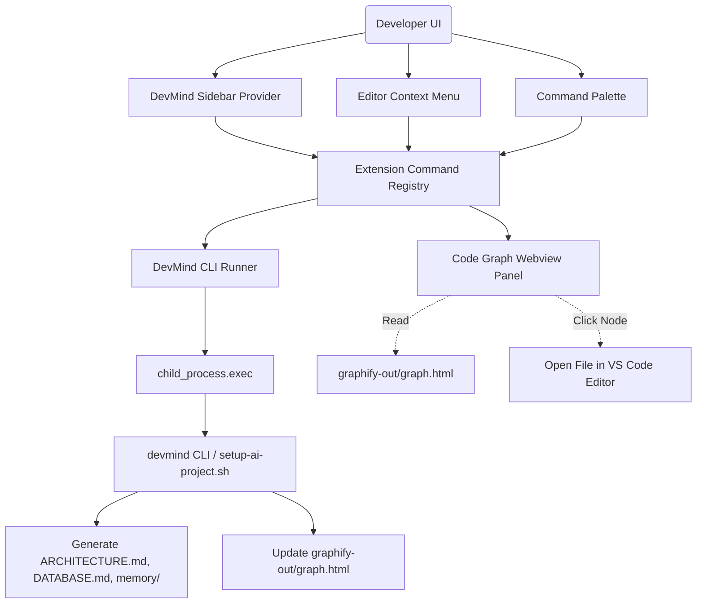

# Guide: DevMind VS Code Extension Architecture & Setup

The **DevMind VS Code Extension** (`devmind-vscode`) integrates the DevMind Enterprise AI OS and CLI directly into the VS Code interface, providing sidebar menus, status bars, and interactive 2D graphs of the codebase structure.

---

## 🏗️ 1. How It Works (Architecture & Components)

The extension is written in TypeScript and uses VS Code's Extension API. It operates via the following core modules:



### Core Source Files (`src/`)

1. **`src/extension.ts` (Activation & Bootstrapping)**:
   - Registers the tree-view container, tree items, commands, and status bar badge.
   - **Auto-Bootstrapping**: Checks if the workspace has a `setup-ai-project.sh` script but lacks the `.agents` folder. If so, it displays a progress notification and runs the script automatically (`echo "Y" | ./setup-ai-project.sh`) to download and configure dependencies (ECC, uv, Graphify, personas, workflows).

2. **`src/devmindRunner.ts` (CLI Bridge)**:
   - Formulates and executes CLI calls via Node's `child_process.exec` (e.g. `devmind doctor`, `devmind sync`).
   - Standardizes environment variables (`NO_COLOR=1`, `TERM=dumb`) and strips ANSI color codes.
   - Directs all output to a dedicated Output Channel named `DevMind OS` so you can view live diagnostic logs.
   - Extracts metrics like the **Engineering Score** to keep status badges updated.

3. **`src/commands/index.ts` (Command Maps)**:
   - Maps editor context menus and command palette actions to their corresponding CLI commands.
   - Displays progress notifications while commands are running.
   - Handles advanced flows like **File Impact Analysis** (`devmind impact <file>`), which prints dependency impacts in the terminal and automatically opens the Code Graph webview centered on that file.

4. **`src/views/devmindSidebar.ts` (Sidebar Dashboard)**:
   - Renders five expandable categories:
     - 🩺 **System Health & Audits**: Displays the current Engineering Score and options to run Doctor Diagnostics, Context Sync, Security Audits, and Database Analyses.
     - 🤖 **AI Task Planner & Review**: Links to plan tasks or review uncommitted git diffs.
     - 📊 **Code Graph & Code Intelligence**: Status of Graphify index, buttons to open the interactive Code Graph, run file impact analyses, and view Git Blame data.
     - 📜 **Architecture Decisions (ADRs)**: Fast commands to create ADRs or open existing records inside `docs/adr/`.
     - 🧠 **Project Memory**: Direct access to `.devmind/memory/*.md` context files.

5. **`src/views/graphWebview.ts` (Interactive 2D Visualizer)**:
   - Launches a VS Code Webview panel displaying `graphify-out/graph.html` (built with Vis.js).
   - Enables bi-directional messaging:
     - **VSIX to Webview**: Sends search/focus queries (e.g., to filter dependencies when doing impact analysis).
     - **Webview to VSIX**: Sends `openFile` commands when double-clicking a node, letting you jump straight to the source code file.

---

## ⚙️ 2. How to Setup & Compile

### Prerequisites
Make sure you have Node.js (v18+) and npm installed on your system.

### Step 1: Install Dependencies
Navigate to the `vscode-extension` directory and run:
```bash
cd vscode-extension
npm install
```

### Step 2: Compile TS to JS
Compile the TypeScript code using the TypeScript compiler:
```bash
npm run compile
```
This generates the Compiled JavaScript files and sourcemaps in the `out/` folder.

### Step 3: Package into VSIX
Package the extension files into a distributable VSIX installer:
```bash
npm run package
```
This will produce a file named `devmind-vscode-1.0.0.vsix` in the directory.

### Step 4: Install in VS Code
Install the packaged extension file into your local VS Code instance:
```bash
code --install-extension devmind-vscode-1.0.0.vsix
```

---

## 🛠️ 3. Usage & Settings

- **Command Palette (`Ctrl+Shift+P` / `Cmd+Shift+P`)**: Search for `DevMind` to see all available commands.
- **Activity Bar**: Look for the **DevMind OS** brain icon in the sidebar to open the DevMind Dashboard.
- **Settings**:
  - `devmind.cliPath`: If the `devmind` CLI is installed in a non-standard location or custom Python environment, you can supply its absolute path here.
